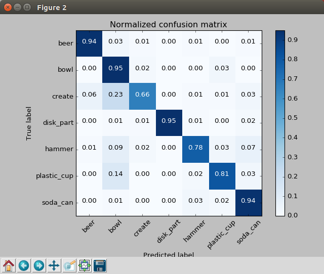
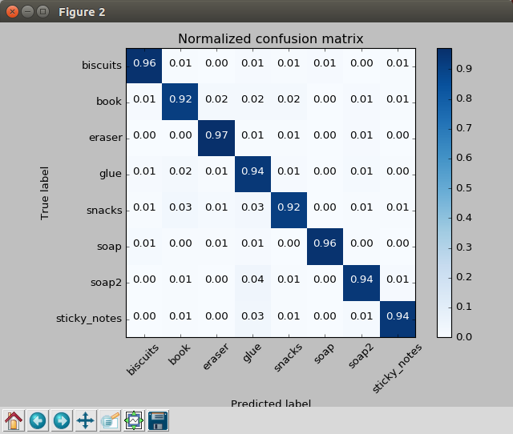

## Project: Perception Pick & Place
### Writeup Template: You can use this file as a template for your writeup if you want to submit it as a markdown file, but feel free to use some other method and submit a pdf if you prefer.

---


# Required Steps for a Passing Submission:
1. Extract features and train an SVM model on new objects (see `pick_list_*.yaml` in `/pr2_robot/config/` for the list of models you'll be trying to identify). 
2. Write a ROS node and subscribe to `/pr2/world/points` topic. This topic contains noisy point cloud data that you must work with.
3. Use filtering and RANSAC plane fitting to isolate the objects of interest from the rest of the scene.
4. Apply Euclidean clustering to create separate clusters for individual items.
5. Perform object recognition on these objects and assign them labels (markers in RViz).
6. Calculate the centroid (average in x, y and z) of the set of points belonging to that each object.
7. Create ROS messages containing the details of each object (name, pick_pose, etc.) and write these messages out to `.yaml` files, one for each of the 3 scenarios (`test1-3.world` in `/pr2_robot/worlds/`).  [See the example `output.yaml` for details on what the output should look like.](https://github.com/udacity/RoboND-Perception-Project/blob/master/pr2_robot/config/output.yaml)  
8. Submit a link to your GitHub repo for the project or the Python code for your perception pipeline and your output `.yaml` files (3 `.yaml` files, one for each test world).  You must have correctly identified 100% of objects from `pick_list_1.yaml` for `test1.world`, 80% of items from `pick_list_2.yaml` for `test2.world` and 75% of items from `pick_list_3.yaml` in `test3.world`.
9. Congratulations!  Your Done!

## [Rubric](https://review.udacity.com/#!/rubrics/1067/view) Points
### Here I will consider the rubric points individually and describe how I addressed each point in my implementation.  

---
### Writeup / README

#### 1. Provide a Writeup / README that includes all the rubric points and how you addressed each one.  You can submit your writeup as markdown or pdf.  

You're reading it!

### Exercise 1, 2 and 3 pipeline implemented
#### 1. Complete Exercise 1 steps. Pipeline for filtering and RANSAC plane fitting implemented.

In Exercise 1, a pipeline for filtering and plane fitting is implemented to extract the image segment that belongs to objects from a Point Cloud image file.

The input image contains Point Cloud data along with the RGB value for each point:


First, the [Voxel Grid Filter](http://pointclouds.org/documentation/tutorials/voxel_grid.php) is applied to the source image to downsample the data size. Using this method enables us to reduce the amount of time for the calculation while keeping the necessary information to perform object recognition.

We use the value 0.01 (1cm) is for the voxel size (leaf size) which seems to be a reasonable choice for both the computational time and the amount of information.

The filtered image is shown below:


Next, the [Pass Through Filter](http://pointclouds.org/documentation/tutorials/passthrough.php) is applied to the downsampled image. We can crop the image with this filter by specifying an axis with cut-off values along that axis.

Applying the filter to the range 0.6 to 1.1 along z-axis gives us the result of retaining only the tabletop and the objects of interest.


The final step in Exercise 1 is to remove the table itself from the scene. To do this we use a popular algorithm known as [RANSAC (RANdom SAmple Consensus)](https://en.wikipedia.org/wiki/Random_sample_consensus).

RANSAC is an algorithm to identify the points that belong to a certain mathematical model. By modeling table as a plane, the algorism identifies a point cloud that does not belong to the model as outliers.

0.01 (1cm) is used as the distance threshold for RANSAC algorithm. By applying the RANSAC, we obtain the point cloud that belongs only to the objects: 

- outlier (objects)


#### 2. Complete Exercise 2 steps: Pipeline including clustering for segmentation implemented.  

In Excercise 2 and the following projects, object recognition pipeline is implemented in a  simulated environment generated by [Gazebo](http://gazebosim.org/).

Below is an image of the generated scenes by Gazebo:


After segmenting input point cloud using the same method implemented in Exercise 1, we need to cluster the segmented point cloud that belongs to individual objects. To do this, we use the [DBSCAN (Density-Based Spatial Clustering of Applications with Noise) algorithm](https://en.wikipedia.org/wiki/DBSCAN#Algorithm).

The DBSCAN algorithm, which is also called as Euclidean Clustering algorithm, is an algorithm that clusters data based on its density. It creates clusters by grouping data points that are within some threshold distance from neighbor points. Only the groups that have more than some threshold number of points are recognized as clusters, while others are marked as outliers.

We use 0.02 and 30 for the distance threshold and the minimum cluster size threshold, respectively. The [k-d tree](https://en.wikipedia.org/wiki/K-d_tree) is used for the nearest neighbor search method.

The pipeline successfully clustered the point cloud into subsets that corresponds to each object:


#### 3. Complete Exercise 3 Steps.  Features extracted and SVM trained.  Object recognition implemented.

In Exercise 3, we classify the clustered point clouds into given object models.

There are 6 object models present in this Exercise:

```py
models = [\
   'beer',
   'bowl',
   'create',
   'disk_part',
   'hammer',
   'plastic_cup',
   'soda_can']
```

A supervised machine learning model [Support Vector Machine (SVM)](https://en.wikipedia.org/wiki/Support_vector_machine) is applied to perform the classification. First, an SVM classifier is trained using a training set of features and labels collected from a training environment. Then the trained classifier is used to predict what object models are in the clusters of a point cloud.

Training features are collected from another Gazebo environment which is an empty environment with only the sensor stick robot and a target object in the scene.


In the training environment, target objects are generated in random orientations and their features are computed based on the point clouds resulting from each of the random orientations. Features are collected with 100 pose variations for each object.


We use color and normal histograms of point cloud for the input features to the classifier. 
Color (RGB) values captured from the sensor stick are converted to HSV values during feature collection. HSV representation of the color values has an advantage of being more robust to lighting conditions than RGB representation.
Color histograms and normal histograms are normalized to the range [0, 256] and [-1, 1] respectively.

In the next step, we train the SVM classifier with the collected features using the [code provided by Udacity](https://github.com/udacity/RoboND-Perception-Exercises/blob/master/Exercise-3/sensor_stick/scripts/train_svm.py). The [confusion matrix](https://en.wikipedia.org/wiki/Confusion_matrix) below shows the performance of the classifier on the training set:



By applying the trained classifier to the test environment, we get a recognition result as shown in the image below. In general, the classifier recognizes objects correctly, but some objects are either miss-clustered or miss-classified.


### Pick and Place Setup

#### 1. For all three tabletop setups (`test*.world`), perform object recognition, then read in respective pick list (`pick_list_*.yaml`). Next construct the messages that would comprise a valid `PickPlace` request output them to `.yaml` format.

Since there are different object models included in the test world 1~3,  SVM classifier is trained on the new models shown below:

```py
models = [\
   'biscuits',
   'soap',
   'soap2',
   'book',
   'glue',
   'sticky_notes',
   'snacks',
   'eraser']
```

In this setup, in order to improve the accuracy of the SVM classifier, we collect features of the target models with 500 different orientations.

Object recognition pipeline is implemented the same way as in previous exercises. Additionally, since the input data in this setup contain noises which might cause failures at various stages in our perception pipeline, the [Statistical Outlier Filter](http://pointclouds.org/documentation/tutorials/statistical_outlier.php) is applied to remove noises in order for the pipeline to perform correctly.

Implementions are in [project_template.py](https://github.com/shingo-uzuki/RoboND-Perception-Project/blob/master/pr2_robot/scripts/project_template.py) file. 

#### Result

Here is a confusion matrix of the classifier applied to the training set:



The classifier is able to recognize all objects with the precision of over 90%.

In the test environment, our perception pipeline recognized all objects correctly (100%) in all the setups (`test[1-3].world`). The result below shows target objects specified in the pick list, output `.yaml` file, and a screenshot of the scenes in each setup:

##### `test1.world`

- target objects (3 objects)
  - biscuits
  - soap
  - soap2

- [output1.yaml](https://github.com/shingo-uzuki/RoboND-Perception-Project/blob/master/output/output1.yaml)

- screenshot


##### `test2.world`

- target objects (5 objects)
  - biscuits
  - soap
  - soap2
  - book
  - glue

- [output2.yaml](https://github.com/shingo-uzuki/RoboND-Perception-Project/blob/master/output/output2.yaml)

- screenshot


##### `test3.world`

- target objects (8 objects)
  - biscuits
  - soap
  - soap2
  - book
  - glue
  - sticky notes
  - snacks
  - eraser

- [output3.yaml](https://github.com/shingo-uzuki/RoboND-Perception-Project/blob/master/output/output3.yaml)

- screenshot


#### Improvements

The pipeline often misclassified the 'glue' object in the `test3.world`. Since the 'glue' object is occluded and only the half of its surface is visible to the sensor, it makes hard for the classifier to correctly classify the objects with such an incomplete point cloud.  A few noises remained also seems to affect the result.

The classification accuracy may be improved by including occlusion and random noise to the features used for the training set.
